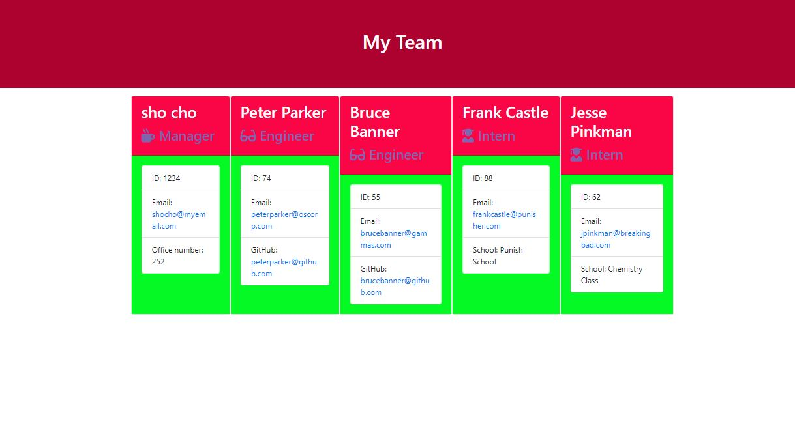

# TABLE OF CONTENTS

[Project Title](#project-title)
[Description](#description)
[Installation](#installation)
[Usage](#usage)
[Guidelines](#guidelines)
[Testing the Application](#testing-the-application)
[Image screenshot of generated webpage](#image-screenshot-of-generated-webpage)
[Citations](#citations)
[Github](#github)
[Contact Us](#contact-us)
[Licence](#licence)

## Project Title

Team Profile Generator

## Description

Application generates a html file when user completes all prompt questions and creates: engineers or interns to be included within the team. The Application will build the team from a set of objects and then renders this to the team.html file stored within the output directory.

## Installation

There is no installation required as the team.html file can be directly opened to view the output in a browser.

## Usage

Navigate to the root directory where this application is located and run node index.js and you will be provided to enter your details as the manager.

You will then be able to choose: to either select to add an Engineer or to add an Intern or to finally build the team.

You can repeat the process of selecting to add and Engineer or Intern as many times as neccessary to complete your team.

## Guidelines

There is no contribution open for this project. You may use the source code for your own purposes.

## Testing the Application

Run the index.js file and see if you can enter and invalid email address.

## Image screenshot of generated webpage

## Citations

The email validation is thanks to Amitabh-K

[Link to Citation](https://gist.github.com/Amitabh-K/ae073eea3d5207efaddffde19b1618e8#file-index-js-L20)

## Github

[Github link](https://github.com/Sho-ayb)

## Questions

Please contact through Github

## Licence

MIT License

Please click on the badge for more details on the licence.

